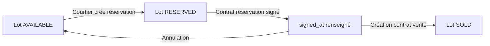
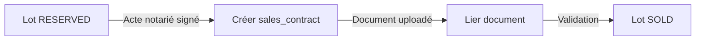
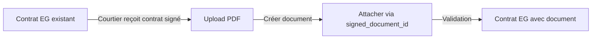

# Module Courtiers - Implémentation Complète

Ce document décrit l'implémentation complète du module Courtiers (Brokers) pour la plateforme SaaS immobilière suisse, incluant le backend NestJS et le frontend React/Supabase.

## Table des matières

1. [Architecture](#architecture)
2. [Backend - NestJS](#backend---nestjs)
3. [Frontend - React + Supabase](#frontend---react--supabase)
4. [Base de données - Supabase](#base-de-données---supabase)
5. [Flux de travail](#flux-de-travail)
6. [Règles métier](#règles-métier)

---

## Architecture

### Vue d'ensemble

Le module Courtiers permet aux courtiers de :

- **Gérer le commercial des lots** : visualiser, filtrer, et mettre à jour le statut des lots (libre → réservé → vendu)
- **Suivre les prospects et réservations** : encoder les dates de signature des contrats de réservation
- **Gérer les contrats de vente** : créer et mettre à jour les contrats de vente (actes notariés) avec dates et documents
- **Contribuer aux contrats EG** : attacher des contrats EG signés (sans toucher aux montants/finance)

### Stack technique

- **Backend**: NestJS + Prisma (adaptable à Supabase)
- **Frontend**: React + TypeScript + Tailwind CSS + Supabase
- **Base de données**: Supabase (PostgreSQL + RLS)
- **Authentification**: Supabase Auth
- **Permissions**: RBAC avec rôle BROKER

---

## Backend - NestJS

> **Note**: Cette section décrit l'architecture NestJS d'origine. Pour l'implémentation Supabase actuelle, voir la section [Frontend - React + Supabase](#frontend---react--supabase).

### Structure du module

```
apps/api/src/modules/brokers/
├── brokers.module.ts
├── brokers.controller.ts
├── brokers.service.ts
└── dto/
    ├── update-lot-status.dto.ts
    ├── create-sales-contract.dto.ts
    ├── update-reservation-signature-date.dto.ts
    └── attach-signed-document.dto.ts
```

### 1. DTOs (Data Transfer Objects)

#### UpdateLotStatusDto

```typescript
// apps/api/src/modules/brokers/dto/update-lot-status.dto.ts
import { IsEnum } from 'class-validator';
import { LotStatus } from '@prisma/client';

export class UpdateLotStatusDto {
  @IsEnum(LotStatus)
  status: LotStatus;
}
```

#### CreateSalesContractDto

```typescript
// apps/api/src/modules/brokers/dto/create-sales-contract.dto.ts
import { IsString, IsOptional, IsDateString } from 'class-validator';

export class CreateSalesContractDto {
  @IsString()
  buyerId: string;

  @IsOptional()
  @IsDateString()
  signedAt?: string;

  @IsOptional()
  @IsDateString()
  effectiveAt?: string;

  @IsOptional()
  @IsString()
  documentId?: string;
}
```

#### UpdateReservationSignatureDateDto

```typescript
// apps/api/src/modules/brokers/dto/update-reservation-signature-date.dto.ts
import { IsDateString, IsOptional } from 'class-validator';

export class UpdateReservationSignatureDateDto {
  @IsOptional()
  @IsDateString()
  signedAt?: string | null;
}
```

#### AttachSignedDocumentDto

```typescript
// apps/api/src/modules/brokers/dto/attach-signed-document.dto.ts
import { IsString } from 'class-validator';

export class AttachSignedDocumentDto {
  @IsString()
  documentId: string;
}
```

### 2. BrokersService

```typescript
// apps/api/src/modules/brokers/brokers.service.ts
import {
  Injectable,
  ForbiddenException,
  NotFoundException,
  BadRequestException,
} from '@nestjs/common';
import { PrismaService } from '../../infra/prisma/prisma.service';
import { UpdateLotStatusDto } from './dto/update-lot-status.dto';
import { CreateSalesContractDto } from './dto/create-sales-contract.dto';
import { UpdateReservationSignatureDateDto } from './dto/update-reservation-signature-date.dto';
import { AttachSignedDocumentDto } from './dto/attach-signed-document.dto';
import { LotStatus, ContractType } from '@prisma/client';

@Injectable()
export class BrokersService {
  constructor(private readonly prisma: PrismaService) {}

  /**
   * Vérifie que l'utilisateur est courtier sur le projet d'un lot donné.
   */
  private async assertUserIsBrokerForLot(lotId: string, userId: string) {
    const lot = await this.prisma.lot.findUnique({
      where: { id: lotId },
      select: {
        id: true,
        projectId: true,
        status: true,
        project: {
          select: {
            participants: {
              select: {
                company: {
                  select: {
                    contacts: true,
                  },
                },
                role: true,
              },
            },
          },
        },
      },
    });

    if (!lot) throw new NotFoundException('Lot introuvable');

    const isBrokerOnProject = await this.prisma.userOrganisation.findFirst({
      where: {
        userId,
        organisation: {
          projects: {
            some: {
              id: lot.projectId,
            },
          },
        },
        role: {
          name: 'BROKER',
        },
      },
      select: { id: true },
    });

    if (!isBrokerOnProject) {
      throw new ForbiddenException(
        'Vous n'êtes pas autorisé à modifier des lots sur ce projet.',
      );
    }

    return lot;
  }

  /**
   * Changer le statut d'un lot en tant que courtier, avec règles métier.
   */
  async updateLotStatus(lotId: string, userId: string, dto: UpdateLotStatusDto) {
    const lot = await this.assertUserIsBrokerForLot(lotId, userId);

    const newStatus = dto.status;

    // Règles de transitions
    if (lot.status === LotStatus.SOLD && newStatus !== LotStatus.SOLD) {
      throw new BadRequestException(
        'Un lot déjà vendu ne peut pas être repassé à un statut inférieur par un courtier.',
      );
    }

    if (newStatus === LotStatus.SOLD) {
      const salesContract = await this.prisma.salesContract.findFirst({
        where: { lotId },
      });
      if (!salesContract) {
        throw new BadRequestException(
          'Impossible de marquer le lot comme vendu sans contrat de vente associé.',
        );
      }
    }

    const updated = await this.prisma.lot.update({
      where: { id: lotId },
      data: { status: newStatus },
    });

    return updated;
  }

  /**
   * Créer un contrat de vente (acte signé) pour un lot.
   */
  async createSalesContractForLot(
    lotId: string,
    userId: string,
    dto: CreateSalesContractDto,
  ) {
    const lot = await this.prisma.lot.findUnique({
      where: { id: lotId },
      include: {
        project: true,
      },
    });
    if (!lot) throw new NotFoundException('Lot introuvable');

    await this.assertUserIsBrokerForLot(lotId, userId);

    const buyer = await this.prisma.buyer.findUnique({
      where: { id: dto.buyerId },
    });
    if (!buyer) throw new NotFoundException('Acheteur introuvable');

    const signedAt = dto.signedAt ? new Date(dto.signedAt) : null;
    const effectiveAt = dto.effectiveAt ? new Date(dto.effectiveAt) : null;

    const salesContract = await this.prisma.salesContract.create({
      data: {
        projectId: lot.projectId,
        lotId: lot.id,
        buyerId: dto.buyerId,
        signedAt,
        effectiveAt,
        documentId: dto.documentId ?? null,
        createdById: userId,
      },
    });

    return salesContract;
  }

  /**
   * Mettre à jour la date de signature d'une réservation.
   */
  async updateReservationSignatureDate(
    reservationId: string,
    userId: string,
    dto: UpdateReservationSignatureDateDto,
  ) {
    const reservation = await this.prisma.reservation.findUnique({
      where: { id: reservationId },
      include: { lot: true },
    });
    if (!reservation) throw new NotFoundException('Réservation introuvable');

    await this.assertUserIsBrokerForLot(reservation.lotId, userId);

    const signedAt = dto.signedAt ? new Date(dto.signedAt) : null;

    return this.prisma.reservation.update({
      where: { id: reservationId },
      data: { signedAt },
    });
  }

  /**
   * Mettre à jour la date de signature d'un contrat de vente.
   */
  async updateSalesContractSignatureDate(
    salesContractId: string,
    userId: string,
    dto: UpdateReservationSignatureDateDto,
  ) {
    const sc = await this.prisma.salesContract.findUnique({
      where: { id: salesContractId },
      include: { lot: true },
    });
    if (!sc) throw new NotFoundException('Contrat de vente introuvable');

    await this.assertUserIsBrokerForLot(sc.lotId, userId);

    const signedAt = dto.signedAt ? new Date(dto.signedAt) : null;

    return this.prisma.salesContract.update({
      where: { id: salesContractId },
      data: { signedAt },
    });
  }

  /**
   * Attacher un document "contrat EG signé" à un contrat existant.
   */
  async attachSignedDocumentToContractEg(
    contractId: string,
    userId: string,
    dto: AttachSignedDocumentDto,
  ) {
    const contract = await this.prisma.contract.findUnique({
      where: { id: contractId },
      include: { project: true },
    });
    if (!contract) throw new NotFoundException('Contrat introuvable');

    const isBrokerOnProject = await this.prisma.userOrganisation.findFirst({
      where: {
        userId,
        organisation: {
          projects: {
            some: {
              id: contract.projectId,
            },
          },
        },
        role: {
          name: 'BROKER',
        },
      },
      select: { id: true },
    });

    if (!isBrokerOnProject) {
      throw new ForbiddenException(
        'Vous ne pouvez pas attacher de document à ce contrat.',
      );
    }

    if (contract.type !== ContractType.EG && contract.type !== ContractType.SUBCONTRACTOR) {
      throw new BadRequestException(
        'Seuls les contrats EG / sous-traitants peuvent recevoir un document signé via ce flux courtier.',
      );
    }

    const doc = await this.prisma.document.findUnique({
      where: { id: dto.documentId },
    });
    if (!doc) throw new NotFoundException('Document introuvable');

    return this.prisma.contract.update({
      where: { id: contractId },
      data: {
        signedDocumentId: dto.documentId,
      },
    });
  }
}
```

### 3. BrokersController

```typescript
// apps/api/src/modules/brokers/brokers.controller.ts
import {
  Controller,
  Patch,
  Post,
  Param,
  Body,
  Req,
  UseGuards,
} from '@nestjs/common';
import { BrokersService } from './brokers.service';
import { JwtAuthGuard } from '../../common/guards/jwt-auth.guard';
import { PermissionsGuard } from '../../common/guards/permissions.guard';
import { Permissions } from '../../common/decorators/permissions.decorator';
import { Permission } from '../../common/enums/permission.enum';
import { UpdateLotStatusDto } from './dto/update-lot-status.dto';
import { CreateSalesContractDto } from './dto/create-sales-contract.dto';
import { UpdateReservationSignatureDateDto } from './dto/update-reservation-signature-date.dto';
import { AttachSignedDocumentDto } from './dto/attach-signed-document.dto';

@Controller('brokers')
@UseGuards(JwtAuthGuard, PermissionsGuard)
export class BrokersController {
  constructor(private readonly brokersService: BrokersService) {}

  @Patch('lots/:lotId/status')
  @Permissions(Permission.LOTS_UPDATE_STATUS_BROKER)
  async updateLotStatus(
    @Param('lotId') lotId: string,
    @Body() dto: UpdateLotStatusDto,
    @Req() req: any,
  ) {
    const userId = req.user.id;
    return this.brokersService.updateLotStatus(lotId, userId, dto);
  }

  @Post('lots/:lotId/sales-contracts')
  @Permissions(Permission.SALES_CONTRACTS_CREATE)
  async createSalesContract(
    @Param('lotId') lotId: string,
    @Body() dto: CreateSalesContractDto,
    @Req() req: any,
  ) {
    const userId = req.user.id;
    return this.brokersService.createSalesContractForLot(lotId, userId, dto);
  }

  @Patch('reservations/:reservationId/signature-date')
  @Permissions(Permission.RESERVATIONS_MANAGE_BROKER)
  async updateReservationSignatureDate(
    @Param('reservationId') reservationId: string,
    @Body() dto: UpdateReservationSignatureDateDto,
    @Req() req: any,
  ) {
    const userId = req.user.id;
    return this.brokersService.updateReservationSignatureDate(
      reservationId,
      userId,
      dto,
    );
  }

  @Patch('sales-contracts/:id/signature-date')
  @Permissions(Permission.SALES_CONTRACTS_UPDATE_DATES)
  async updateSalesContractSignatureDate(
    @Param('id') salesContractId: string,
    @Body() dto: UpdateReservationSignatureDateDto,
    @Req() req: any,
  ) {
    const userId = req.user.id;
    return this.brokersService.updateSalesContractSignatureDate(
      salesContractId,
      userId,
      dto,
    );
  }

  @Post('contracts-eg/:contractId/signed-document')
  @Permissions(Permission.CONTRACTS_ATTACH_SIGNED_DOC_BROKER)
  async attachSignedDocumentToContractEg(
    @Param('contractId') contractId: string,
    @Body() dto: AttachSignedDocumentDto,
    @Req() req: any,
  ) {
    const userId = req.user.id;
    return this.brokersService.attachSignedDocumentToContractEg(
      contractId,
      userId,
      dto,
    );
  }
}
```

### 4. BrokersModule

```typescript
// apps/api/src/modules/brokers/brokers.module.ts
import { Module } from '@nestjs/common';
import { BrokersController } from './brokers.controller';
import { BrokersService } from './brokers.service';
import { PrismaService } from '../../infra/prisma/prisma.service';

@Module({
  controllers: [BrokersController],
  providers: [BrokersService, PrismaService],
})
export class BrokersModule {}
```

### 5. Endpoints API

| Méthode | Endpoint | Permission | Description |
|---------|----------|------------|-------------|
| PATCH | `/brokers/lots/:lotId/status` | `LOTS_UPDATE_STATUS_BROKER` | Mettre à jour le statut d'un lot |
| POST | `/brokers/lots/:lotId/sales-contracts` | `SALES_CONTRACTS_CREATE` | Créer un contrat de vente pour un lot |
| PATCH | `/brokers/reservations/:reservationId/signature-date` | `RESERVATIONS_MANAGE_BROKER` | Mettre à jour la date de signature d'une réservation |
| PATCH | `/brokers/sales-contracts/:id/signature-date` | `SALES_CONTRACTS_UPDATE_DATES` | Mettre à jour la date de signature d'un contrat de vente |
| POST | `/brokers/contracts-eg/:contractId/signed-document` | `CONTRACTS_ATTACH_SIGNED_DOC_BROKER` | Attacher un document signé à un contrat EG |

---

## Frontend - React + Supabase

### Structure des fichiers

```
src/
├── hooks/
│   └── useBrokers.ts                    # Hooks React pour operations courtier
├── pages/
│   ├── BrokerDashboard.tsx              # Dashboard principal courtier
│   ├── BrokerLots.tsx                   # Gestion des lots
│   └── BrokerSalesContracts.tsx         # Gestion contrats de vente
└── components/
    ├── ui/
    │   ├── Badge.tsx
    │   ├── Button.tsx
    │   ├── Card.tsx
    │   └── Input.tsx
    └── layout/
        ├── AppShell.tsx
        ├── Sidebar.tsx
        └── Topbar.tsx
```

### 1. Hooks React (useBrokers.ts)

Voir le fichier complet: `src/hooks/useBrokers.ts`

**Hooks disponibles:**

- `useBrokerProjects()` - Liste des projets du courtier
- `useBrokerLots(projectId?)` - Liste des lots avec filtrage optionnel
- `useBrokerSalesContracts(projectId?)` - Liste des contrats de vente
- `useBrokerReservations(projectId?)` - Liste des réservations

**Fonctions d'API:**

- `updateLotStatus(lotId, newStatus)` - Mettre à jour le statut d'un lot
- `updateReservationSignatureDate(reservationId, signedAt)` - Mettre à jour date signature réservation
- `createSalesContract(...)` - Créer un contrat de vente
- `updateSalesContract(...)` - Mettre à jour un contrat de vente
- `attachSignedDocumentToContract(...)` - Attacher un document signé

**Exemple d'utilisation:**

```typescript
import { useBrokerLots, updateLotStatus } from '../hooks/useBrokers';

function MyComponent() {
  const { data: lots, loading, refetch } = useBrokerLots(projectId);

  const handleStatusChange = async (lotId: string, newStatus: string) => {
    const result = await updateLotStatus(lotId, newStatus as any);
    if (result.success) {
      refetch();
    }
  };

  return (
    // ... render lots
  );
}
```

### 2. Pages principales

#### BrokerDashboard.tsx

Dashboard principal avec:
- Cartes de statistiques (lots disponibles, réservés, vendus, contrats signés)
- Filtre par projet
- Tableau des lots commercialisables
- Tableau des réservations actives
- Liens vers pages détaillées

**Route suggérée**: `/broker/dashboard`

#### BrokerLots.tsx

Page de gestion des lots avec:
- Filtres par statut et type
- Tableau complet avec toutes les caractéristiques des lots
- Modal pour changer le statut avec règles de transition
- Indicateurs visuels pour dates de signature

**Route suggérée**: `/broker/lots`

#### BrokerSalesContracts.tsx

Page de gestion des contrats de vente avec:
- Création de nouveaux contrats
- Modification des dates de signature et d'effet
- Visualisation des documents associés
- Téléchargement des actes signés

**Route suggérée**: `/broker/sales-contracts`

### 3. Intégration avec Supabase

**Configuration Supabase** (`src/lib/supabase.ts`):

```typescript
import { createClient } from '@supabase/supabase-js';

const supabaseUrl = import.meta.env.VITE_SUPABASE_URL;
const supabaseAnonKey = import.meta.env.VITE_SUPABASE_ANON_KEY;

export const supabase = createClient(supabaseUrl, supabaseAnonKey);
```

**Exemple de requête avec RLS:**

```typescript
// Les RLS policies assurent automatiquement que le courtier
// ne voit que les projets où il est assigné
const { data: lots, error } = await supabase
  .from('lots')
  .select(`
    *,
    building:buildings(*),
    project:projects(*),
    reservations(*),
    sales_contracts(*)
  `)
  .eq('project_id', projectId);
```

### 4. Composants UI réutilisables

Tous les composants UI sont dans `src/components/ui/`:

- **Badge**: Affichage de statuts avec variants (success, warning, error, info)
- **Button**: Boutons avec variants (primary, secondary) et sizes (sm, md, lg)
- **Card**: Conteneurs avec style uniforme
- **Input**: Champs de formulaire stylisés

---

## Base de données - Supabase

### Tables créées par la migration

#### `sales_contracts`

Contrats de vente (actes notariés):

```sql
CREATE TABLE sales_contracts (
  id uuid PRIMARY KEY DEFAULT gen_random_uuid(),
  project_id uuid NOT NULL REFERENCES projects(id) ON DELETE CASCADE,
  lot_id uuid NOT NULL REFERENCES lots(id) ON DELETE CASCADE,
  buyer_id uuid NOT NULL REFERENCES buyers(id) ON DELETE CASCADE,
  signed_at timestamptz,
  effective_at timestamptz,
  document_id uuid REFERENCES documents(id) ON DELETE SET NULL,
  notes text,
  created_by_id uuid NOT NULL REFERENCES users(id),
  created_at timestamptz DEFAULT now() NOT NULL,
  updated_at timestamptz DEFAULT now() NOT NULL
);
```

#### Modifications des tables existantes

**reservations**:
```sql
ALTER TABLE reservations ADD COLUMN signed_at timestamptz;
```

**contracts**:
```sql
ALTER TABLE contracts ADD COLUMN signed_document_id uuid REFERENCES documents(id);
```

**project_participants**:
```sql
ALTER TABLE project_participants ADD COLUMN user_id uuid REFERENCES users(id);
ALTER TABLE project_participants ADD COLUMN status participant_status DEFAULT 'ACTIVE';
```

### Permissions créées

```sql
INSERT INTO permissions (resource, action, name, description)
VALUES
  ('lots', 'update_status_broker', 'lots:update_status:broker',
   'Brokers can update lot status within allowed transitions'),
  ('reservations', 'manage_broker', 'reservations:manage:broker',
   'Brokers can manage reservations and signature dates'),
  ('sales_contracts', 'create', 'sales_contracts:create',
   'Create sales contracts (actes notariés)'),
  ('sales_contracts', 'update', 'sales_contracts:update',
   'Update sales contract dates and documents'),
  ('sales_contracts', 'read', 'sales_contracts:read',
   'View sales contracts'),
  ('contracts', 'attach_signed_doc_broker', 'contracts:attach_signed_doc:broker',
   'Brokers can attach signed documents to EG contracts');
```

### Row Level Security (RLS)

Les policies RLS assurent que:
1. Les courtiers ne voient que les projets où ils sont participants avec rôle BROKER
2. Les courtiers ne peuvent modifier que les lots de leurs projets
3. Les admins et développeurs ont accès à tous les projets de leur organisation

**Exemple de policy:**

```sql
CREATE POLICY "Brokers can view sales contracts for their projects"
  ON sales_contracts
  FOR SELECT
  TO authenticated
  USING (
    EXISTS (
      SELECT 1 FROM project_participants pp
      WHERE pp.project_id = sales_contracts.project_id
        AND pp.user_id = auth.uid()
        AND pp.role = 'BROKER'
        AND pp.status = 'ACTIVE'
    )
  );
```

---

## Flux de travail

### 1. Réservation d'un lot



**Actions courtier:**
1. Changer statut lot de `AVAILABLE` à `RESERVED`
2. Créer une réservation dans la table `reservations`
3. Renseigner `signed_at` quand contrat de réservation est signé

### 2. Vente d'un lot



**Actions courtier:**
1. Créer un `sales_contract` avec `buyerId`, `lotId`
2. Renseigner `signed_at` (date signature acte)
3. Uploader le PDF de l'acte → créer `document`
4. Lier `document_id` au `sales_contract`
5. Changer statut lot à `SOLD`

### 3. Contrats EG signés



**Actions courtier:**
1. Uploader le PDF du contrat EG signé
2. Créer un `document` avec catégorie appropriée
3. Appeler API pour attacher `document_id` au `contract.signed_document_id`
4. Le courtier ne peut PAS modifier les montants/avenants/situations

---

## Règles métier

### Transitions de statut autorisées pour les courtiers

| Statut actuel | Transitions autorisées | Conditions |
|---------------|----------------------|------------|
| `AVAILABLE` | `RESERVED` | Aucune condition préalable |
| `RESERVED` | `AVAILABLE` | Annulation de réservation |
| `RESERVED` | `SOLD` | Un `sales_contract` doit exister avec `signed_at` |
| `SOLD` | ❌ Aucune | Le statut SOLD est définitif pour les courtiers |
| `DELIVERED` | ❌ Aucune | Géré uniquement par promoteur/admin |

### Permissions par action

| Action | Permission requise | Scope |
|--------|-------------------|-------|
| Voir les lots | `lots:read` | Projets assignés au courtier |
| Changer statut lot | `lots:update_status:broker` | Projets assignés + transitions autorisées |
| Créer contrat de vente | `sales_contracts:create` | Projets assignés |
| Modifier dates contrat | `sales_contracts:update` | Projets assignés |
| Voir contrats de vente | `sales_contracts:read` | Projets assignés |
| Gérer réservations | `reservations:manage:broker` | Projets assignés |
| Attacher doc contrat EG | `contracts:attach_signed_doc:broker` | Projets assignés + contrats EG/Sous-traitants uniquement |

### Validations métier

#### Changement de statut lot

```typescript
// Règles dans BrokersService.updateLotStatus()
if (lot.status === 'SOLD' && newStatus !== 'SOLD') {
  throw new BadRequestException(
    'Un lot déjà vendu ne peut pas être repassé à un statut inférieur'
  );
}

if (newStatus === 'SOLD') {
  const salesContract = await prisma.salesContract.findFirst({
    where: { lotId }
  });
  if (!salesContract) {
    throw new BadRequestException(
      'Impossible de marquer comme vendu sans contrat de vente'
    );
  }
}
```

#### Création contrat de vente

```typescript
// Validations dans BrokersService.createSalesContractForLot()
1. Vérifier que le lot existe
2. Vérifier que l'utilisateur est courtier sur le projet
3. Vérifier que le buyerId correspond à un acheteur existant
4. Créer le sales_contract avec dates et document
5. Optionnel: passer automatiquement le lot en SOLD
```

#### Signature de réservation

```typescript
// Règles dans BrokersService.updateReservationSignatureDate()
1. Vérifier que la réservation existe
2. Vérifier que l'utilisateur est courtier sur le projet
3. Vérifier que la réservation n'est pas expirée/annulée
4. Mettre à jour signed_at
```

### Restrictions importantes

❌ **Les courtiers NE PEUVENT PAS:**
- Modifier les montants des contrats (CFC, avenants, situations)
- Créer ou modifier des contrats EG (sauf attacher documents signés)
- Valider financièrement des situations de travaux
- Modifier des factures ou paiements
- Accéder aux données financières détaillées du promoteur

✅ **Les courtiers PEUVENT:**
- Voir et filtrer les lots de leurs projets
- Mettre à jour le statut commercial des lots
- Créer et gérer les contrats de vente (actes notariés)
- Encoder les dates de signature (réservations et ventes)
- Uploader et lier des documents contractuels
- Suivre leurs prospects et réservations

---

## Migration depuis NestJS vers Supabase

Si vous migrez d'une architecture NestJS/Prisma vers Supabase:

### 1. Remplacer les appels API

**Avant (NestJS):**
```typescript
const response = await fetch('/api/brokers/lots/:id/status', {
  method: 'PATCH',
  body: JSON.stringify({ status: 'RESERVED' })
});
```

**Après (Supabase):**
```typescript
const { data, error } = await supabase
  .from('lots')
  .update({ status: 'RESERVED' })
  .eq('id', lotId);
```

### 2. Adapter les validations

Les validations métier dans `BrokersService` doivent être:
- Soit déplacées côté frontend (vérifications avant appel)
- Soit implémentées via des triggers PostgreSQL
- Soit via des Edge Functions Supabase

**Exemple de trigger pour valider transition de statut:**

```sql
CREATE OR REPLACE FUNCTION validate_lot_status_change()
RETURNS TRIGGER AS $$
BEGIN
  -- Empêcher SOLD → autre statut
  IF OLD.status = 'SOLD' AND NEW.status != 'SOLD' THEN
    RAISE EXCEPTION 'Cannot change status of sold lot';
  END IF;

  -- Exiger sales_contract pour SOLD
  IF NEW.status = 'SOLD' THEN
    IF NOT EXISTS (
      SELECT 1 FROM sales_contracts WHERE lot_id = NEW.id
    ) THEN
      RAISE EXCEPTION 'Cannot mark as sold without sales contract';
    END IF;
  END IF;

  RETURN NEW;
END;
$$ LANGUAGE plpgsql;

CREATE TRIGGER check_lot_status_before_update
  BEFORE UPDATE ON lots
  FOR EACH ROW
  EXECUTE FUNCTION validate_lot_status_change();
```

### 3. Permissions RLS vs Guards NestJS

**NestJS Guards:**
```typescript
@UseGuards(JwtAuthGuard, PermissionsGuard)
@Permissions(Permission.LOTS_UPDATE_STATUS_BROKER)
async updateLotStatus(...) { }
```

**Supabase RLS:**
```sql
CREATE POLICY "Brokers can update lots status"
  ON lots FOR UPDATE
  USING (
    EXISTS (
      SELECT 1 FROM project_participants
      WHERE project_id = lots.project_id
        AND user_id = auth.uid()
        AND role = 'BROKER'
        AND status = 'ACTIVE'
    )
  );
```

---

## Tests et validation

### Tests unitaires côté frontend

```typescript
// Exemple avec Vitest
import { describe, it, expect, vi } from 'vitest';
import { updateLotStatus } from '../hooks/useBrokers';

describe('useBrokers', () => {
  it('should update lot status successfully', async () => {
    const result = await updateLotStatus('lot-123', 'RESERVED');
    expect(result.success).toBe(true);
  });

  it('should handle errors gracefully', async () => {
    const result = await updateLotStatus('invalid-id', 'SOLD');
    expect(result.success).toBe(false);
    expect(result.error).toBeDefined();
  });
});
```

### Tests d'intégration RLS

```sql
-- Se connecter en tant que courtier
SET LOCAL role TO authenticated;
SET LOCAL "request.jwt.claims" TO '{"sub": "courtier-user-id"}';

-- Tester lecture lots autorisés
SELECT * FROM lots WHERE project_id = 'authorized-project';
-- Devrait retourner des résultats

-- Tester lecture lots non autorisés
SELECT * FROM lots WHERE project_id = 'unauthorized-project';
-- Devrait retourner 0 résultat
```

### Checklist de validation

- [ ] Un courtier ne voit que les projets où il est assigné
- [ ] Un courtier peut changer le statut d'un lot (transitions autorisées)
- [ ] Un courtier ne peut PAS passer SOLD → autre statut
- [ ] Un courtier ne peut PAS marquer SOLD sans sales_contract
- [ ] Un courtier peut créer un sales_contract
- [ ] Un courtier peut mettre à jour les dates de signature
- [ ] Un courtier peut attacher un document à un contrat EG
- [ ] Un courtier ne peut PAS modifier les montants des contrats
- [ ] Les logs d'audit sont créés pour chaque modification de statut
- [ ] Les RLS policies bloquent l'accès aux projets non autorisés

---

## Support et documentation

### Fichiers de référence

- Migration DB: `supabase/migrations/008_enhance_courtiers_module.sql`
- Hooks React: `src/hooks/useBrokers.ts`
- Dashboard: `src/pages/BrokerDashboard.tsx`
- Gestion lots: `src/pages/BrokerLots.tsx`
- Contrats vente: `src/pages/BrokerSalesContracts.tsx`

### Resources externes

- [Supabase RLS Documentation](https://supabase.com/docs/guides/auth/row-level-security)
- [Supabase Client Library](https://supabase.com/docs/reference/javascript)
- [React Query for Supabase](https://tanstack.com/query/latest)
- [Tailwind CSS](https://tailwindcss.com/docs)

### Évolutions futures

**Phase 2: Notifications**
- Notifier le promoteur quand un courtier change un statut
- Notifier le courtier quand un acheteur signe

**Phase 3: Reporting**
- Tableau de bord avec métriques de ventes par courtier
- Export des données de ventes

**Phase 4: Commissions**
- Calcul automatique des commissions courtier
- Suivi des paiements de commissions

---

## Annexe: Correspondance NestJS ↔ Supabase

| Concept NestJS | Équivalent Supabase | Notes |
|----------------|---------------------|-------|
| `@Controller()` | Edge Function ou direct Supabase client | Logic côté client avec RLS |
| `@Injectable() Service` | Fonctions TypeScript + Supabase queries | Ou Edge Functions pour logique complexe |
| `@UseGuards(JwtAuthGuard)` | `supabase.auth.getUser()` | Auth automatique avec RLS |
| `PermissionsGuard` | RLS Policies | Permissions vérifiées au niveau DB |
| DTOs avec `class-validator` | Zod schemas ou validation manuelle | Validation côté client |
| Prisma queries | Supabase queries | `supabase.from('table').select()` |
| Transactions Prisma | Supabase RPC + transactions PG | Via stored procedures |

---

**Version**: 1.0
**Date**: Décembre 2024
**Auteur**: Architecture Team
