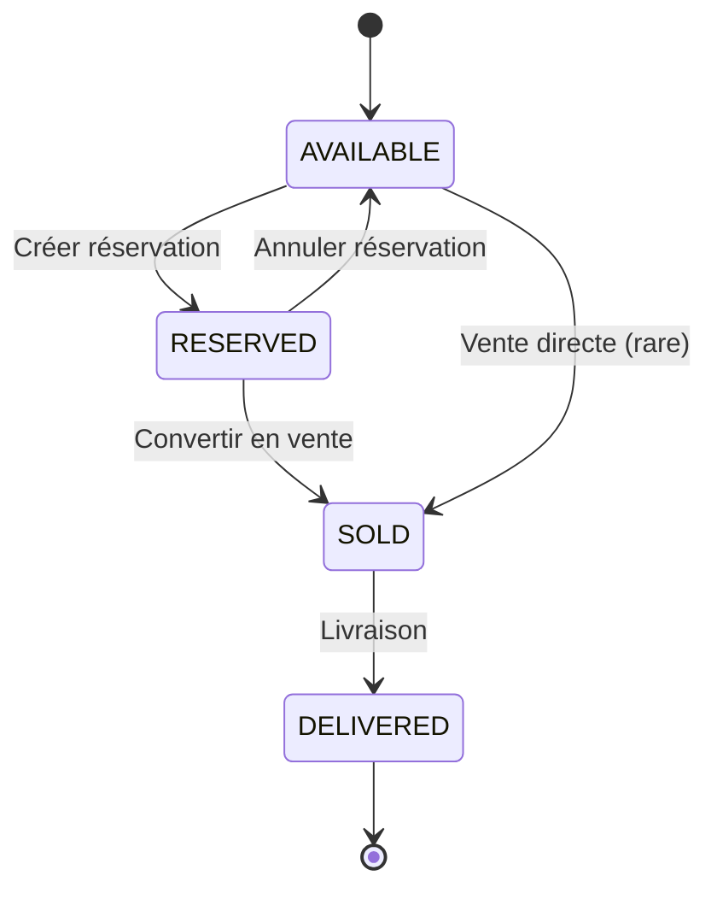
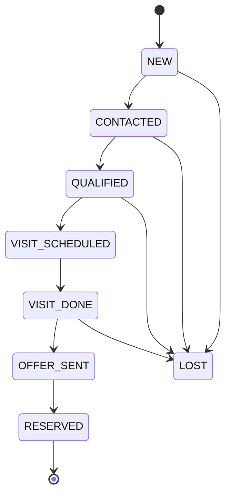
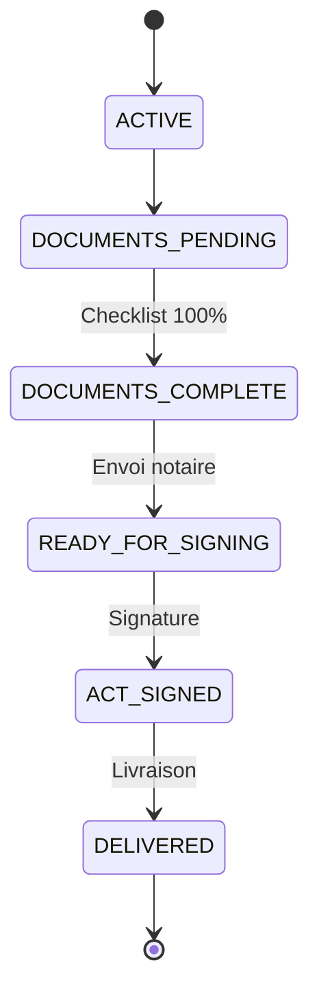
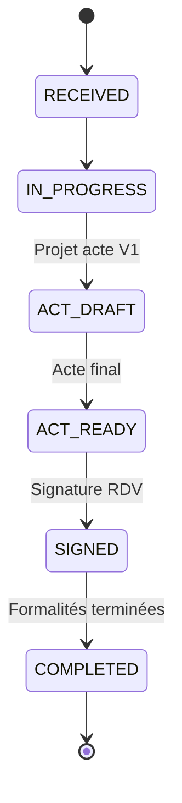
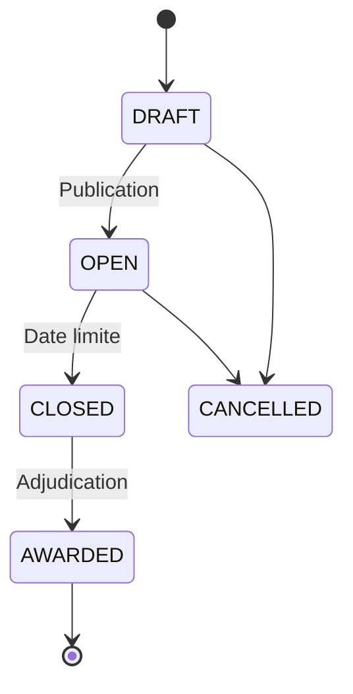

# 🔄 WORKFLOWS MÉTIER - SaaS Immobilier Suisse

> Workflows complets pour les processus métier critiques

---

## Table des matières

1. [Workflow Vente PPE/QPT](#1-workflow-vente-ppeqpt)
2. [Workflow Notaire](#2-workflow-notaire)
3. [Workflow Soumissions & Adjudications](#3-workflow-soumissions--adjudications)
4. [Workflow Choix matériaux](#4-workflow-choix-matériaux)
5. [Workflow Acomptes acheteurs](#5-workflow-acomptes-acheteurs)
6. [Workflow Documents](#6-workflow-documents)
7. [États et transitions](#7-états-et-transitions)

---

## 1. Workflow Vente PPE/QPT

### 1.1 Vue d'ensemble

```
┌─────────────┐
│   PROSPECT  │
│    (NEW)    │
└──────┬──────┘
       │ Qualification
       ▼
┌─────────────┐
│  PROSPECT   │
│ (QUALIFIED) │
└──────┬──────┘
       │ Visite + Offre
       ▼
┌─────────────┐
│ RESERVATION │
│  (PENDING)  │
└──────┬──────┘
       │ Confirmation + Dépôt
       ▼
┌─────────────┐
│ RESERVATION │
│ (CONFIRMED) │
└──────┬──────┘
       │ Conversion
       ▼
┌─────────────┐
│   BUYER     │
│  (ACTIVE)   │
└──────┬──────┘
       │ Constitution dossier
       ▼
┌─────────────┐
│   BUYER     │
│  DOCS_COMPLETE │
└──────┬──────┘
       │ Envoi notaire
       ▼
┌─────────────┐
│ NOTARY_FILE │
│ (IN_PROGRESS) │
└──────┬──────┘
       │ Acte final
       ▼
┌─────────────┐
│ NOTARY_FILE │
│ (ACT_READY) │
└──────┬──────┘
       │ Signature
       ▼
┌─────────────┐
│   BUYER     │
│ (ACT_SIGNED) │
└──────┬──────┘
       │ Livraison
       ▼
┌─────────────┐
│   BUYER     │
│ (DELIVERED) │
└─────────────┘
```

### 1.2 Étapes détaillées

#### Étape 1 : Acquisition prospect

**Acteurs** : Courtier, Promoteur

**Déclencheur** :
- Formulaire site web
- Salon immobilier
- Appel téléphonique
- Recommandation

**Actions** :
1. Création fiche prospect dans CRM
   ```typescript
   POST /projects/:projectId/crm/prospects
   {
     firstName: string
     lastName: string
     email: string
     phone: string
     source: 'WEB' | 'SALON' | 'BROKER' | 'REFERRAL'
     interestedLots: string[] // lot IDs
     budgetMin: number
     budgetMax: number
   }
   ```

2. Attribution à un courtier (optionnel)
   ```typescript
   PATCH /prospects/:id/assign
   {
     assignedTo: userId
   }
   ```

3. Notification courtier assigné

**Résultat** : Prospect en statut `NEW`

---

#### Étape 2 : Qualification

**Acteurs** : Courtier

**Actions** :
1. Premier contact (téléphone/email)
2. Qualification besoins :
   - Type de bien recherché
   - Budget réel
   - Échéance d'achat
   - Financement (cash/crédit)

3. Mise à jour statut
   ```typescript
   PATCH /prospects/:id/status
   {
     status: 'CONTACTED' | 'QUALIFIED'
     notes: string
   }
   ```

**Résultat** : Prospect `QUALIFIED`

---

#### Étape 3 : Visite & Offre

**Acteurs** : Courtier, Promoteur

**Actions** :
1. Planification visite
   ```typescript
   POST /prospects/:id/visits
   {
     scheduledAt: DateTime
     lots: string[]
     notes: string
   }
   ```

2. Mise à jour après visite
   ```typescript
   PATCH /prospects/:id/status
   {
     status: 'VISIT_DONE'
     notes: "Client très intéressé par lot A-3-01"
   }
   ```

3. Envoi offre personnalisée
   ```typescript
   POST /prospects/:id/send-offer
   {
     lotId: string
     customMessage: string
     attachments: string[] // PDF brochure, plans
   }
   ```

**Résultat** : Prospect `OFFER_SENT`

---

#### Étape 4 : Réservation

**Acteurs** : Courtier, Promoteur

**Conditions** :
- ✅ Lot disponible (`AVAILABLE`)
- ✅ Client décidé
- ✅ Accord verbal

**Actions** :
1. Création réservation
   ```typescript
   POST /projects/:projectId/crm/reservations
   {
     lotId: string
     prospectId: string
     buyerFirstName: string
     buyerLastName: string
     buyerEmail: string
     buyerPhone: string
     depositAmount: number
     expiresAt: DateTime  // +30 jours
     brokerId?: string
     brokerCommissionRate?: number
   }
   ```

2. **Effet automatique** :
   - Lot passe en statut `RESERVED`
   - Notification promoteur
   - Email confirmation client

3. Envoi demande de dépôt de garantie
   ```typescript
   POST /reservations/:id/send-deposit-request
   ```

**Résultat** : Réservation `PENDING`, Lot `RESERVED`

---

#### Étape 5 : Confirmation réservation

**Acteurs** : Courtier, Promoteur

**Conditions** :
- ✅ Dépôt de garantie payé
- ✅ Accord de principe financement (si crédit)

**Actions** :
1. Upload preuve de paiement dépôt
   ```typescript
   PATCH /reservations/:id/deposit
   {
     depositPaidAt: DateTime
     depositProof: fileUrl
   }
   ```

2. Confirmation réservation
   ```typescript
   PATCH /reservations/:id/confirm
   {
     status: 'CONFIRMED'
   }
   ```

**Résultat** : Réservation `CONFIRMED`

---

#### Étape 6 : Conversion en vente

**Acteurs** : Promoteur

**Conditions** :
- ✅ Réservation confirmée
- ✅ Financement validé
- ✅ Accord définitif client

**Actions** :
1. Conversion réservation → buyer
   ```typescript
   POST /reservations/:id/convert
   {
     // Informations complètes acheteur
     address: string
     city: string
     postalCode: string
     birthDate: DateTime
     nationality: string
     isIndividual: boolean
     coBuyers?: Array<{
       firstName: string
       lastName: string
       birthDate: DateTime
     }>
     financingType: 'CASH' | 'MORTGAGE' | 'MIXED'
     bankName?: string
     mortgageAmount?: number
     notaryId: string
   }
   ```

2. **Effets automatiques** :
   - Création `Buyer`
   - Création `BuyerFile` avec checklist documents
   - Lot passe en statut `SOLD`
   - Génération plan d'acomptes
   - Notification notaire désigné

**Résultat** : Buyer `ACTIVE`, Lot `SOLD`

---

#### Étape 7 : Constitution dossier acheteur

**Acteurs** : Acheteur, Promoteur

**Objectif** : Rassembler tous les documents requis pour le notaire

**Documents requis** (checklist automatique) :
- ✅ Pièce d'identité (CNI/Passeport)
- ✅ Justificatif de domicile
- ✅ Justificatif de fonds propres
- ✅ Pré-accord crédit (si applicable)
- ✅ Accord crédit final
- ✅ Certificat de mariage (si applicable)
- ✅ Permis de séjour (si étranger)
- ✅ Déclaration d'impôts (selon cas)

**Actions** :
1. Acheteur upload documents
   ```typescript
   POST /buyers/:id/file/documents
   {
     requirementId: string
     file: File
     notes?: string
   }
   ```

2. Promoteur valide documents
   ```typescript
   PATCH /buyers/:id/file/requirements/:reqId
   {
     status: 'RECEIVED' | 'VALIDATED' | 'REJECTED'
     notes?: string
   }
   ```

3. **Calcul automatique** : `completionPercentage`
   ```typescript
   completionPercentage = (validatedCount / requiredCount) * 100
   ```

4. **Déclencheur automatique** : Si 100%
   ```typescript
   if (completionPercentage === 100) {
     buyerFile.isComplete = true
     buyer.status = 'DOCUMENTS_COMPLETE'
     // Notification promoteur
   }
   ```

**Résultat** : Buyer `DOCUMENTS_COMPLETE`

---

#### Étape 8 : Envoi au notaire

**Acteurs** : Promoteur

**Conditions** :
- ✅ Dossier acheteur complet (`isComplete = true`)

**Actions** :
1. Envoi dossier au notaire
   ```typescript
   POST /buyers/:id/send-to-notary
   {
     notaryId: string
     message?: string
   }
   ```

2. **Effets automatiques** :
   - Création `NotaryFile`
   - Buyer passe en `READY_FOR_SIGNING`
   - Notification notaire (email + in-app)
   - Création fil de discussion dédié

**Résultat** : NotaryFile `RECEIVED`, Buyer `READY_FOR_SIGNING`

---

### 1.3 Gestion des annulations

#### Annulation réservation

**Conditions** :
- Réservation expirée (`expiresAt < now`)
- Acheteur se retire
- Financement refusé

**Actions** :
```typescript
POST /reservations/:id/cancel
{
  reason: 'EXPIRED' | 'BUYER_WITHDREW' | 'FINANCING_REJECTED' | 'OTHER'
  notes?: string
}
```

**Effets** :
- Réservation → `CANCELLED`
- Lot → `AVAILABLE`
- Remboursement dépôt (selon conditions)

#### Annulation vente

**Conditions** :
- Avant signature acte
- Raison majeure (accord des deux parties)

**Actions** :
```typescript
POST /buyers/:id/cancel
{
  reason: string
  refundDeposit: boolean
}
```

**Effets** :
- Buyer → `CANCELLED`
- Lot → `AVAILABLE`
- Annulation dossier notaire
- Annulation plan acomptes

---

## 2. Workflow Notaire

### 2.1 Vue d'ensemble

```
┌──────────────────┐
│  NOTARY_FILE     │
│   (RECEIVED)     │  ← Dossier acheteur complet envoyé
└────────┬─────────┘
         │ Étude dossier
         ▼
┌──────────────────┐
│  NOTARY_FILE     │
│  (IN_PROGRESS)   │
└────────┬─────────┘
         │ Projet d'acte V1
         ▼
┌──────────────────┐
│  ActVersion V1   │
│  uploadée        │
└────────┬─────────┘
         │ Aller-retours (clarifications)
         ▼
┌──────────────────┐
│  ActVersion V2, V3 │
└────────┬─────────┘
         │ Acte final
         ▼
┌──────────────────┐
│  NOTARY_FILE     │
│   (ACT_READY)    │
└────────┬─────────┘
         │ Planification RDV
         ▼
┌──────────────────┐
│  Appointment     │
│  (SCHEDULED)     │
└────────┬─────────┘
         │ Signature
         ▼
┌──────────────────┐
│  NOTARY_FILE     │
│    (SIGNED)      │
└────────┬─────────┘
         │ Formalités complètes
         ▼
┌──────────────────┐
│  NOTARY_FILE     │
│  (COMPLETED)     │
└──────────────────┘
```

### 2.2 Étapes détaillées

#### Étape 1 : Réception dossier

**Acteur** : Notaire

**Déclencheur** : Promoteur envoie dossier complet

**Actions notaire** :
1. Connexion espace notaire
2. Consultation dossier
   ```typescript
   GET /notary/files/:id
   ```

3. Vérification documents
4. Mise à jour statut
   ```typescript
   PATCH /notary/files/:id/status
   {
     status: 'IN_PROGRESS'
   }
   ```

**Résultat** : NotaryFile `IN_PROGRESS`

---

#### Étape 2 : Rédaction acte

**Acteur** : Notaire

**Actions** :
1. Rédaction projet d'acte (hors système)
2. Upload version 1
   ```typescript
   POST /notary/files/:id/acts
   {
     title: "Projet d'acte V1"
     file: File (PDF)
     notes: "Premier projet pour relecture"
   }
   ```

3. **Effets automatiques** :
   - Création `NotaryActVersion` (version = 1)
   - Notification promoteur
   - Notification acheteur (si accès)

**Résultat** : ActVersion V1 créée

---

#### Étape 3 : Clarifications & itérations

**Acteurs** : Notaire, Promoteur, Acheteur

**Workflow** :
1. Promoteur/Acheteur consulte projet acte
2. Questions via fil de discussion dédié
   ```typescript
   POST /notary/files/:id/messages
   {
     content: "Pourriez-vous préciser la clause X ?"
     mentions: [notaryUserId]
   }
   ```

3. Notaire répond et/ou upload V2
   ```typescript
   POST /notary/files/:id/acts
   {
     title: "Projet d'acte V2"
     file: File
     notes: "Modifications suite à remarques"
   }
   ```

**Itérations** : V1 → V2 → V3 → ... → Vn (finale)

---

#### Étape 4 : Acte final

**Acteur** : Notaire

**Conditions** :
- ✅ Toutes clarifications résolues
- ✅ Accord promoteur + acheteur

**Actions** :
1. Upload acte final
   ```typescript
   POST /notary/files/:id/acts
   {
     title: "Acte authentique final"
     file: File
     notes: "Version définitive pour signature"
     isFinal: true
   }
   ```

2. Changement statut
   ```typescript
   PATCH /notary/files/:id/status
   {
     status: 'ACT_READY'
   }
   ```

**Résultat** : NotaryFile `ACT_READY`

---

#### Étape 5 : Planification rendez-vous signature

**Acteur** : Notaire

**Actions** :
1. Création RDV
   ```typescript
   POST /notary/files/:id/appointments
   {
     scheduledAt: DateTime
     location: "Étude notariale, Rue X, Genève"
     attendees: [
       { name: "John Doe", role: "Acheteur", confirmed: false },
       { name: "Jane Doe", role: "Co-acheteur", confirmed: false },
       { name: "Promoteur SA", role: "Vendeur", confirmed: false }
     ]
   }
   ```

2. **Effets automatiques** :
   - Notifications tous les participants (email + SMS)
   - Ajout calendrier (iCal)

**Résultat** : Appointment `SCHEDULED`

---

#### Étape 6 : Signature

**Acteur** : Notaire

**Actions le jour J** :
1. Signature physique acte authentique
2. Confirmation dans système
   ```typescript
   PATCH /notary/files/:id/appointments/:aptId
   {
     status: 'COMPLETED'
   }
   ```

3. Upload acte signé
   ```typescript
   POST /notary/files/:id/acts
   {
     title: "Acte authentique signé"
     file: File (PDF signé)
     isSigned: true
   }
   ```

4. Changement statut
   ```typescript
   PATCH /notary/files/:id/status
   {
     status: 'SIGNED'
   }
   ```

5. **Effets automatiques** :
   - Buyer → `ACT_SIGNED`
   - Notification promoteur
   - Déclenchement acomptes suivants

**Résultat** : NotaryFile `SIGNED`, Buyer `ACT_SIGNED`

---

## 3. Workflow Soumissions & Adjudications

### 3.1 Vue d'ensemble

```
┌─────────────────┐
│  SUBMISSION     │
│    (DRAFT)      │  ← Création soumission
└────────┬────────┘
         │ Publication
         ▼
┌─────────────────┐
│  SUBMISSION     │
│    (OPEN)       │  ← Invitation entreprises
└────────┬────────┘
         │ Dépôt offres
         ▼
┌─────────────────┐
│  Offers         │
│  déposées       │
└────────┬────────┘
         │ Clôture
         ▼
┌─────────────────┐
│  SUBMISSION     │
│   (CLOSED)      │
└────────┬────────┘
         │ Analyse comparative
         ▼
┌─────────────────┐
│  Comparatif     │
│  généré         │
└────────┬────────┘
         │ Adjudication
         ▼
┌─────────────────┐
│  SUBMISSION     │
│   (AWARDED)     │
└────────┬────────┘
         │ Notification
         ▼
┌─────────────────┐
│  Contract       │
│  créé           │
└─────────────────┘
```

### 3.2 Étapes détaillées

#### Étape 1 : Création soumission

**Acteurs** : Architecte, Promoteur

**Actions** :
1. Création brouillon
   ```typescript
   POST /projects/:projectId/submissions
   {
     title: "Lot électricité - Bâtiment A"
     description: string
     cfcLineIds: string[]
     status: 'DRAFT'
   }
   ```

2. Ajout documents (plans, métrés, descriptifs)
   ```typescript
   POST /submissions/:id/documents
   {
     files: File[]
     category: 'PLANS' | 'SPECIFICATIONS' | 'METRICS'
   }
   ```

3. Configuration dates
   ```typescript
   PATCH /submissions/:id
   {
     questionsDeadline: DateTime  // Date limite questions
     closingDate: DateTime         // Date limite dépôt offres
   }
   ```

**Résultat** : Submission `DRAFT`

---

#### Étape 2 : Invitation entreprises

**Acteurs** : Architecte, Promoteur

**Actions** :
1. Sélection entreprises
   ```typescript
   POST /submissions/:id/invites
   {
     companyIds: string[]
     message: "Vous êtes invités à soumissionner..."
   }
   ```

2. **Effets automatiques** :
   - Email invitation avec lien sécurisé
   - Création accès portail soumissionnaire
   - Notification in-app (si compte existant)

3. Publication soumission
   ```typescript
   PATCH /submissions/:id/status
   {
     status: 'OPEN'
   }
   ```

**Résultat** : Submission `OPEN`, Invitations envoyées

---

#### Étape 3 : Dépôt offres (Portail entreprise)

**Acteurs** : Entreprises soumissionnaires

**Accès** : Via lien sécurisé ou compte entreprise

**Actions entreprise** :
1. Connexion portail
   ```typescript
   GET /submissions/:id/public?token=XXX
   ```

2. Consultation documents
3. Questions (pendant période autorisée)
   ```typescript
   POST /submissions/:id/questions
   {
     content: "Quelle est la longueur totale des câbles ?"
     isPublic: true  // Visible à tous ou privé
   }
   ```

4. Dépôt offre
   ```typescript
   POST /submissions/:id/offers
   {
     companyId: string
     totalAmount: number
     deliveryDelay: number  // jours
     notes: string
     items: [
       {
         submissionLotId: string
         unitPrice: number
         quantity: number
         totalPrice: number
       }
     ]
   }
   ```

5. Upload documents (bordereau, certifications)
   ```typescript
   POST /submissions/:id/offers/:offerId/documents
   {
     files: File[]
   }
   ```

**Versioning offres** : Entreprise peut réviser offre jusqu'à clôture

**Résultat** : SubmissionOffer créée

---

#### Étape 4 : Clôture soumission

**Déclencheur** : Date limite atteinte (automatique) ou action manuelle

**Actions automatiques** :
```typescript
// Cronjob exécuté à closingDate
PATCH /submissions/:id/status
{
  status: 'CLOSED'
}
```

**Effets** :
- Plus de dépôt/modification offres possible
- Notification architecte/promoteur
- Génération comparatif automatique

**Résultat** : Submission `CLOSED`

---

#### Étape 5 : Analyse comparative

**Acteurs** : Architecte, Promoteur

**Actions** :
1. Consultation comparatif
   ```typescript
   GET /submissions/:id/comparison
   ```

   **Réponse** :
   ```json
   {
     "offers": [
       {
         "companyId": "xxx",
         "companyName": "Entreprise A",
         "totalAmount": 250000,
         "deliveryDelay": 90,
         "isCompliant": true,
         "items": [...]
       },
       {
         "companyId": "yyy",
         "companyName": "Entreprise B",
         "totalAmount": 230000,
         "deliveryDelay": 120,
         "isCompliant": true
       }
     ],
     "statistics": {
       "minOffer": 230000,
       "maxOffer": 280000,
       "avgOffer": 255000
     },
     "recommendation": "Entreprise B (meilleur rapport qualité/prix)"
   }
   ```

2. Clarifications complémentaires
   ```typescript
   POST /submissions/:id/offers/:offerId/clarifications
   {
     question: "Pouvez-vous préciser le délai de livraison ?"
   }
   ```

**Résultat** : Analyse complète

---

#### Étape 6 : Adjudication

**Acteurs** : Architecte (proposition), Promoteur (validation)

**Actions** :
1. Proposition architecte
   ```typescript
   POST /submissions/:id/adjudication/propose
   {
     submissionOfferId: string
     justification: "Meilleur rapport qualité/prix + références solides"
   }
   ```

2. Validation promoteur
   ```typescript
   POST /submissions/:id/adjudication/confirm
   {
     submissionOfferId: string
   }
   ```

3. **Effets automatiques** :
   - Création `Adjudication`
   - Submission → `AWARDED`
   - Notification entreprise retenue
   - Notification entreprises non retenues (optionnel)
   - **Création contrat automatique**
   ```typescript
   POST /projects/:projectId/finance/contracts
   {
     companyId: adjudication.offer.companyId
     amount: adjudication.offer.totalAmount
     type: 'LOT'
     status: 'DRAFT'
     cfcLineId: submission.cfcLineId
   }
   ```
   - **Mise à jour CFC** : Engagement += montant adjugé

**Résultat** : Submission `AWARDED`, Contract créé

---

## 4. Workflow Choix matériaux

### 4.1 Vue d'ensemble

```
┌──────────────────┐
│  Catalogue       │
│  matériaux       │  ← EG/Architecte alimente
└────────┬─────────┘
         │ Acheteur accède
         ▼
┌──────────────────┐
│  Espace choix    │
│  acheteur        │
└────────┬─────────┘
         │ Sélection options
         ▼
┌──────────────────┐
│  BuyerChoices    │
│  enregistrés     │
└────────┬─────────┘
         │ Soumission choix
         ▼
┌──────────────────┐
│  Validation      │
│  EG/Architecte   │
└────────┬─────────┘
         │ Génération PDF
         ▼
┌──────────────────┐
│  Récapitulatif   │
│  signé           │
└──────────────────┘
```

### 4.2 Étapes détaillées

#### Étape 1 : Alimentation catalogue

**Acteurs** : EG, Architecte

**Actions** :
1. Création catégories
   ```typescript
   POST /materials/categories
   {
     name: "Revêtements sols"
     description: string
     sortOrder: number
   }
   ```

2. Ajout options
   ```typescript
   POST /materials/categories/:categoryId/options
   {
     name: "Parquet chêne naturel"
     description: string
     imageUrl: string
     price: 0  // Standard (inclus)
     isDefault: true
   }

   POST /materials/categories/:categoryId/options
   {
     name: "Parquet chêne foncé premium"
     price: 2500  // Surcoût CHF
     isDefault: false
   }
   ```

**Résultat** : Catalogue alimenté

---

#### Étape 2 : Choix acheteur

**Acteur** : Acheteur

**Accès** : Espace acheteur dédié

**Actions** :
1. Consultation catalogue
   ```typescript
   GET /buyers/:buyerId/choices/catalog
   ```

2. Sélection options
   ```typescript
   POST /buyers/:buyerId/choices
   {
     materialOptionId: string
     notes?: string
   }
   ```

3. **Calcul automatique** : Total surcoûts
   ```typescript
   totalExtras = sum(selectedOptions.filter(o => o.price > 0).map(o => o.price))
   ```

4. Validation finale
   ```typescript
   POST /buyers/:buyerId/choices/submit
   ```

**Résultat** : BuyerChoices enregistrés, statut `SUBMITTED`

---

#### Étape 3 : Validation EG

**Acteur** : EG, Architecte

**Actions** :
1. Revue choix
   ```typescript
   GET /buyers/:buyerId/choices
   ```

2. Validation ou demande ajustement
   ```typescript
   PATCH /buyers/:buyerId/choices/validate
   {
     status: 'VALIDATED' | 'NEEDS_ADJUSTMENT'
     notes?: string
   }
   ```

3. Génération PDF récapitulatif
   ```typescript
   POST /buyers/:buyerId/choices/generate-pdf
   ```

**Résultat** : Choix validés, PDF généré

---

#### Étape 4 : Modifications spéciales

**Cas** : Acheteur souhaite modification hors catalogue

**Workflow** :
1. Demande modification
   ```typescript
   POST /buyers/:buyerId/change-requests
   {
     description: "Souhait déplacer cloison chambre"
     urgency: 'NORMAL' | 'HIGH'
   }
   ```

2. Chiffrage EG/Architecte
   ```typescript
   POST /buyers/:buyerId/change-requests/:id/impacts
   {
     type: 'PRICE'
     amount: 5000
     description: "Modification cloison"
   }

   POST /buyers/:buyerId/change-requests/:id/impacts
   {
     type: 'DELAY'
     delayDays: 14
     description: "Retard livraison estimé"
   }
   ```

3. Validation acheteur
   ```typescript
   PATCH /change-requests/:id/accept
   ```

4. Génération avenant
   ```typescript
   POST /change-requests/:id/generate-amendment
   ```

**Résultat** : Avenant signé, prix et délai mis à jour

---

## 5. Workflow Acomptes acheteurs

### 5.1 Vue d'ensemble

```
┌──────────────────┐
│  Conversion      │
│  Buyer           │  ← Plan acomptes appliqué
└────────┬─────────┘
         │ Génération échéances
         ▼
┌──────────────────┐
│  Installments    │
│  (PENDING)       │
└────────┬─────────┘
         │ Échéance atteinte
         ▼
┌──────────────────┐
│  Génération      │
│  facture         │
└────────┬─────────┘
         │ Envoi acheteur
         ▼
┌──────────────────┐
│  Paiement        │
│  reçu            │
└────────┬─────────┘
         │ Rapprochement
         ▼
┌──────────────────┐
│  Installment     │
│  (PAID)          │
└──────────────────┘
```

### 5.2 Étapes détaillées

#### Étape 1 : Génération plan acomptes

**Déclencheur** : Conversion réservation → buyer

**Plan type** (exemple Suisse) :
- 10% à la signature réservation (déjà payé)
- 20% à la signature acte authentique
- 30% gros œuvre terminé
- 30% second œuvre terminé
- 10% remise des clés

**Actions automatiques** :
```typescript
// Lors de la création Buyer
const lotPrice = buyer.lot.priceTotal
const plan = project.settings.installmentPlan

plan.stages.forEach((stage, index) => {
  createInstallment({
    buyerId: buyer.id,
    lotId: buyer.lot.id,
    installmentNumber: index + 1,
    percentage: stage.percentage,
    amount: lotPrice * (stage.percentage / 100),
    dueDate: calculateDueDate(stage.trigger),
    status: 'PENDING'
  })
})
```

**Résultat** : 5 Installments `PENDING` créés

---

#### Étape 2 : Génération facture

**Déclencheur** :
- Échéance atteinte (automatique)
- Action manuelle promoteur

**Actions** :
1. Génération facture
   ```typescript
   POST /buyers/:buyerId/installments/:installmentId/generate-invoice
   ```

2. **Création Invoice**
   ```typescript
   {
     type: 'BUYER_INSTALLMENT'
     amount: installment.amount
     vatRate: lot.vatRate
     vatAmount: calculated
     totalAmount: amount + vatAmount
     dueAt: installment.dueDate
     status: 'SENT'
   }
   ```

3. Envoi email acheteur avec PDF
   ```typescript
   POST /invoices/:id/send-email
   ```

**Résultat** : Invoice `SENT`, email envoyé

---

#### Étape 3 : Paiement

**Acteur** : Acheteur (externe)

**Moyens paiement** :
- Virement bancaire
- Bulletin de versement (BVR)

**Actions système** :
1. Import relevé bancaire (manuel ou API)
2. Rapprochement paiement
   ```typescript
   POST /invoices/:id/payments
   {
     amount: number
     paymentDate: DateTime
     paymentMethod: 'BANK_TRANSFER'
     reference: string  // Ref. facture
   }
   ```

3. **Effets automatiques** :
   - Invoice → `PAID`
   - Installment → `PAID`
   - Notification promoteur

**Résultat** : Installment `PAID`

---

#### Étape 4 : Gestion retards

**Déclencheur** : Cron job quotidien

**Actions automatiques** :
```typescript
// Chaque jour
const overdueInstallments = await prisma.installment.findMany({
  where: {
    status: 'PENDING',
    dueDate: { lt: new Date() }
  }
})

overdueInstallments.forEach(inst => {
  // Mise à jour statut
  inst.status = 'OVERDUE'

  // Notification promoteur
  notifyPromoter(...)

  // Email relance acheteur (J+7, J+14, J+30)
  if (daysOverdue in [7, 14, 30]) {
    sendReminderEmail(inst.buyerId)
  }
})
```

**Résultat** : Relances automatiques

---

## 6. Workflow Documents

### 6.1 Structure arborescence automatique

**Création projet** → Génération dossiers :

```
📁 [Nom Projet]
├── 📁 01 - Juridique
│   ├── 📁 Règlements PPE
│   ├── 📁 Autorisations
│   └── 📁 Servitudes
├── 📁 02 - Plans
│   ├── 📁 Architecture
│   ├── 📁 Techniques
│   └── 📁 Exécution
├── 📁 03 - Contrats
│   ├── 📁 EG
│   ├── 📁 Lots techniques
│   └── 📁 Autres
├── 📁 04 - Soumissions
│   └── [Dossiers par soumission]
├── 📁 05 - Commercial
│   ├── 📁 Brochures
│   ├── 📁 Plans vente
│   └── 📁 Offres
├── 📁 06 - Dossiers acheteurs
│   └── [Dossier par acheteur]
├── 📁 07 - Chantier
│   ├── 📁 PV réunions
│   ├── 📁 Photos
│   └── 📁 Rapports
└── 📁 08 - Divers
```

### 6.2 Upload document

**Actions** :
```typescript
POST /projects/:projectId/documents
{
  name: string
  parentFolderId: string
  category: DocumentCategory
  file: File
  tags?: string[]
}
```

**Effets automatiques** :
- Upload S3/MinIO
- Extraction metadata (taille, type)
- Indexation fulltext (optionnel)
- Notification rôles concernés (selon tags)

---

## 7. États et transitions

### 7.1 Lot



**Règles** :
- `RESERVED` → Max 30-90 jours
- `SOLD` → Irréversible (sauf annulation judiciaire)

### 7.2 Prospect



### 7.3 Buyer



### 7.4 NotaryFile



### 7.5 Submission



---

## 🎯 Résumé des workflows

| Workflow | Durée moyenne | Acteurs principaux | Étapes clés | Automatisations |
|----------|---------------|-------------------|-------------|-----------------|
| **Vente PPE** | 3-6 mois | Courtier, Promoteur, Acheteur, Notaire | 8 | ✅ Checklist, Notifications, Plan acomptes |
| **Notaire** | 1-2 mois | Notaire, Promoteur, Acheteur | 6 | ✅ Versioning actes, Notifications |
| **Soumissions** | 1-2 mois | Architecte, Entreprises, Promoteur | 6 | ✅ Comparatif, CFC update |
| **Choix matériaux** | 1-3 mois | Acheteur, EG | 4 | ✅ Calcul surcoûts, PDF |
| **Acomptes** | Durée projet | Promoteur, Acheteur | 4 | ✅ Génération factures, Relances |

---

**Ce document complète NESTJS_ARCHITECTURE.md et BUSINESS_MODULES.md avec les workflows complets.**
